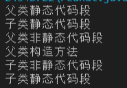

<center><H2><b>父子类构造函数、静态代码段、非静态代码段调用顺序</b></H2></center><br>

父子类构造函数、静态代码段、非静态代码段调用顺序。

静态代码段 -> 非静态代码段 -> 构造函数（静态代码段优先除外，父类的初始化优先于子类的初始化）

```java
package Java_test;
public class ClassInitTest {
    public static void main(String[] args) {
        new Child();
    }
}
class Father {
    static {
        System.out.println("父类静态代码段");
    }
    { // 非静态代码段一定要用{}包裹
        System.out.println("父类非静态代码段");
    }
    public Father(){
        System.out.println("父类构造方法");
    }
}
class Child extends Father{
    static {
        System.out.println("子类静态代码段");
    }
    {
        System.out.println("子类非静态代码段");
    }
    public Child(){
        System.out.println("子类静态代码段");
    }
}
```

**顺序如下：**

